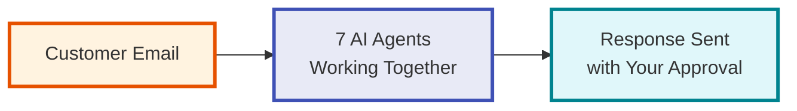
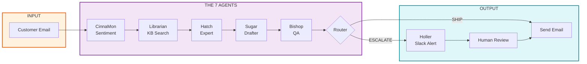
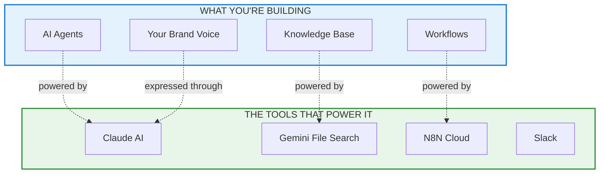
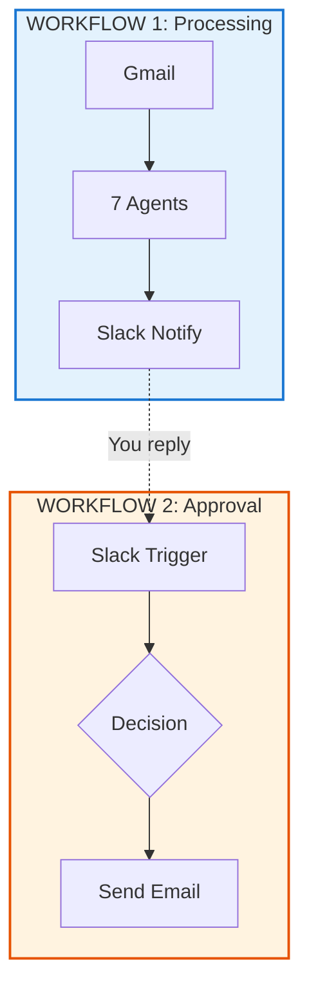

# Architecture Overview

**Understanding the 7-agent email automation system**

Welcome to the architecture guide! This document helps you understand what you're building and how all the pieces fit together.

---

## Quick Links

- [Simple View](#the-simplest-view) - 3-box overview
- [7 Agents](#the-7-agents) - Meet your AI team
- [Data Flow](#data-flow-example) - Watch an email get processed
- [Component Reference](#component-reference) - Quick lookup table

---

## The Simplest View



**That's it.** Email comes in, AI processes it, you approve, email goes out.

---

## The 7 Agents



### Meet the Team

| Agent | Job | One-Line Description |
|-------|-----|---------------------|
| **CinnaMon** | Sentiment | "I read the emotional temperature" |
| **Librarian** | KB Search | "I find answers in your documents" |
| **Hatch** | Expert | "I synthesize and analyze" |
| **Sugar** | Drafter | "I write in your voice" |
| **Bishop** | QA | "I check before sending" |
| **Router** | Decision | "I decide: ship or escalate?" |
| **Holler** | Notification | "I ping you when needed" |

---

## Concepts vs Tools



**The key insight:** You focus on the concepts (your knowledge, your voice). The tools handle the technical work.

---

## Data Flow Example

Let's follow a real email through the system:

**Scenario:** Customer emails asking about gluten-free options

```
1. EMAIL ARRIVES
   "Do you have gluten-free options?"
   ↓

2. CINNAMON (2 sec)
   Detects: Curious, first-time visitor
   Urgency: Low-medium
   ↓

3. LIBRARIAN (3 sec)
   Searches KB, finds:
   - Menu items
   - Allergen policy
   - Cross-contamination disclaimer
   ↓

4. HATCH (4 sec)
   Synthesizes answer:
   "Chicken is GF, these sides are safe,
   mention cross-contamination risk"
   ↓

5. SUGAR (5 sec)
   Drafts in your voice:
   "Hey! Great news about our GF options..."
   ↓

6. BISHOP (3 sec)
   Checks: Facts ✓ Tone ✓ Complete ✓
   Verdict: SHIP
   ↓

7. ROUTER
   → Direct to SEND (no escalation needed)
   ↓

8. EMAIL SENT
   Total time: ~17 seconds
```

---

## Component Reference

### Quick Lookup Table

| Component | Type | AI Model | When You See It |
|-----------|------|----------|-----------------|
| CinnaMon | Agent | Claude | Session 1 |
| Librarian | Agent | **Gemini** (required) | Session 2 |
| Hatch | Agent | Claude | Session 2 |
| Sugar | Agent | Claude | Session 2 |
| Bishop | Agent | Claude | Session 3 |
| Router | Agent | Claude | Session 3 |
| Holler | Agent | N8N/Slack | Session 3 |

**Important:** Librarian MUST use Gemini because File Search is Gemini-only.

### What You Customize

| Agent | Customization Level | What You Change |
|-------|---------------------|-----------------|
| CinnaMon | Low | Rarely touched |
| Librarian | Low | Just your store IDs |
| Hatch | Medium | Domain expertise |
| **Sugar** | **HIGH** | Your entire brand voice |
| Bishop | Medium | QA criteria |
| Router | Low | Routing rules |
| **Holler** | **HIGH** | Slack format, escalation triggers |

**Focus your time on Sugar and Holler** - they define your customer experience.

---

## Two-Workflow Architecture

The system runs as two separate N8N workflows:



**Why two workflows?**
1. Processing is automatic (no waiting)
2. Approval waits for you (human-gated)
3. If Slack is down, processing still works

---

## The Numbers

| Metric | Value |
|--------|-------|
| Processing time | ~13-20 seconds |
| Cost per email | ~$0.03 |
| Auto-handle rate | 80% of emails |
| Human review rate | 20% of emails |

---

## FAQ

**Q: What if I want to add more agents?**
A: The architecture is modular. Add agents as N8N workflow steps.

**Q: Can I use GPT instead of Claude?**
A: Yes for most agents. But Librarian MUST use Gemini (File Search requirement).

**Q: What if Slack is down?**
A: Workflow 1 still processes. You just won't get notifications until Slack is back.

**Q: How do I change the brand voice?**
A: Edit Sugar's system prompt. That's where your personality lives.

---

## Next Steps

1. **Understand this architecture** (you're here!)
2. **Set up your Knowledge Base** → [Build Your KB Guide](../guides/03-build-your-kb.md)
3. **Customize your agents** → Start with Sugar

---

*Questions about architecture? Ask in Slack or during office hours.*
